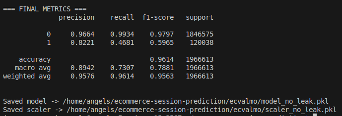

# 🛒 Ecommerce Session Prediction
**Predicting purchase intent from large-scale ecommerce user behavior data**
----
## 📘 Overview

This project focuses on predicting whether an ecommerce browsing session will result in a purchase, using large-scale clickstream behavioral data. It covers the entire pipeline:

- Data ingestion & preprocessing

- Efficient storage and querying under hardware constraints

- Feature engineering

- Machine learning modeling

- Evaluation and insights
___
The primary goal is to build a reproducible ML workflow capable of handling millions of events on modest/local hardware without requiring distributed systems or cloud compute.
___
## 📦 Datasets

This project uses public datasets sourced from **Kaggle**, specifically:

### 1. Ecommerce Behavior Data from Multi-Category Store

Contains:

- user behavior logs

- event types (view, cart, purchase)

- timestamps

- device/browser info

- product metadata

### 2. Ecommerce Purchases Dataset

Contains:

- purchase events

- session-level linkage

- cart and checkout sequences


Datasets taken from: 
https://www.kaggle.com/datasets/mkechinov/ecommerce-behavior-data-from-multi-category-store

---

## ⚙️ Project Motivation & Constraints
The entire pipeline was built on modest, outdated hardware, which imposed significant design constraints:

🧩 Hardware Limitations

- Limited RAM

- Slow disk I/O

- No GPU

- Cannot run Spark or other distributed engines

🛠️ Engineering Workarounds

To handle millions of events efficiently:

✔ Parquet Instead of CSV

- Compressed

- Columnar

- Much faster scanning

- Greatly reduced memory pressure

✔ DuckDB Instead of Pandas-Only or Spark

DuckDB enables:

- Running SQL directly on Parquet files

- Querying data larger than RAM

- In-memory OLAP-like performance on a laptop

✔ Chunked / Streaming Processing

Used whenever pandas operations were unavoidable.

✔ Memory-Aware Modeling

Feature selection & aggregation were optimized for speed and resource limits.

These techniques make the repo valuable for anyone working with limited compute power.

---
🧠 Machine Learning Approach
---

The modeling pipeline includes:

- Logistic Regression

- Random Forest

- (Optional) XGBoost, depending on resources

- Session-level aggregation

- Behavioral frequency features

- Time-based patterns

Evaluation metrics:

- ROC-AUC

- Precision / Recall

- F1 Score

- Confusion Matrix

- Feature importance insights
- ---
📂 Repository Structure
---
```
ecommerce-session-prediction/
│
├── cleanbig/                   # Data ingestion + parquet/dask/duckdb processing
│   └── data/                   # Parquet datasets (ignored by git)
│
├── ecvalmo/
│   └── scripts/                # Model training script (train_model.py)
│
├── requirements.txt            # Python dependencies
├── README.md                   # Project documentation
└── .gitignore                  # Environment, data, and artifact exclusions
```
---
## 🚀 How to Run
1. Clone the repository
```
git clone https://github.com/AngelRy/ecommerce-session-prediction.git
cd ecommerce-session-prediction
```
2. Create and activate a virtual environment
```
python3 -m venv ecom_env_new
source ecom_env_new/bin/activate     # Linux/macOS
# OR
ecom_env_new\Scripts\activate        # Windows
```
3. Install dependencies
```
pip install -r requirements.txt
```
4. Start exploration or run scripts
```
jupyter lab

```
---
## 🧰 Tech Stack

- Python 3.11

- DuckDB — in-process analytical engine

- Pandas (chunked/streaming usage)

- NumPy

- Scikit-learn

- Parquet (PyArrow backend)

- Matplotlib / Seaborn
----

## 🏗️ Key Strength: Working With Limited Hardware

This project highlights practical strategies for building scalable ML pipelines without cloud resources:

parquet for fast storage

duckdb for analytical queries

dataframe chunking

lightweight modeling

memory-efficient feature engineering

Ideal for:

students

learners with standard laptops

Kaggle participants

anyone without access to powerful compute

## 📊 Example Model Output


